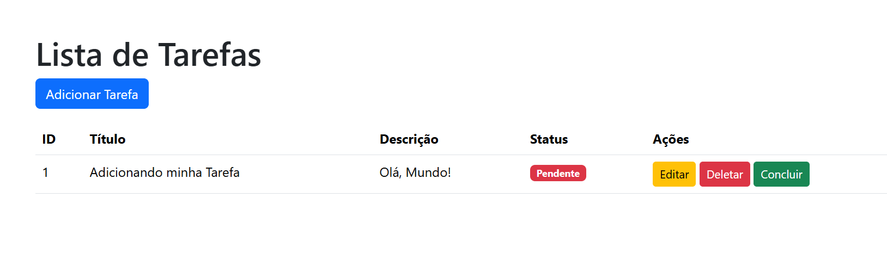
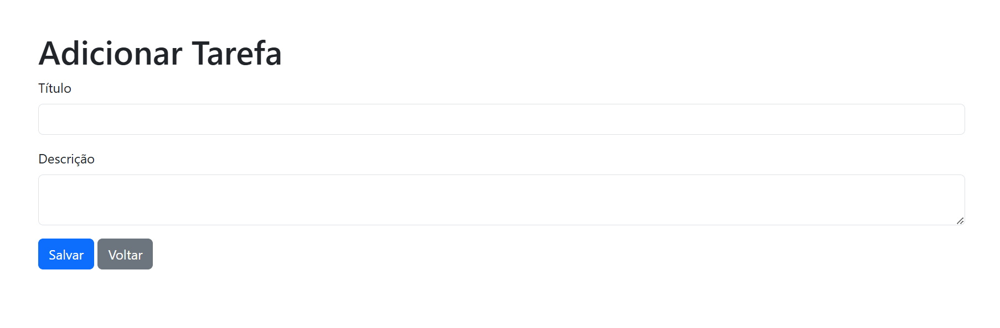

# 📒 CRUD Lista de Tarefas

💡 Sobre o Projeto
Este projeto é um sistema simples de tarefas desenvolvido com Flask. 
Ele inclui funcionalidades como adicionar, editar, remover e marcar uma tarefa como concluída.

## 🚀**Tecnologias Utilizadas**   
Python🐍  
Flask🌐  
SQLAlchemy🗃  
HTML e Bootstrap🎨  

📸 Página Inicial

📸 Página Adicionar Tarefa

